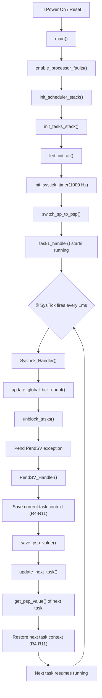
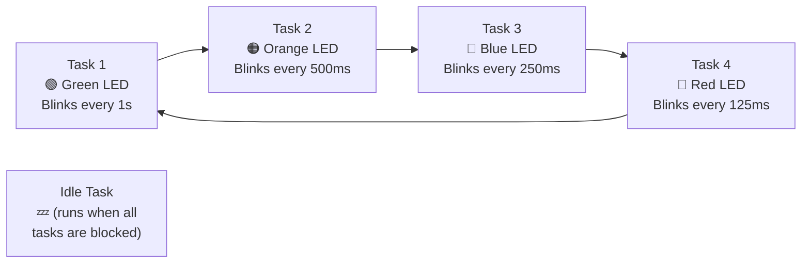
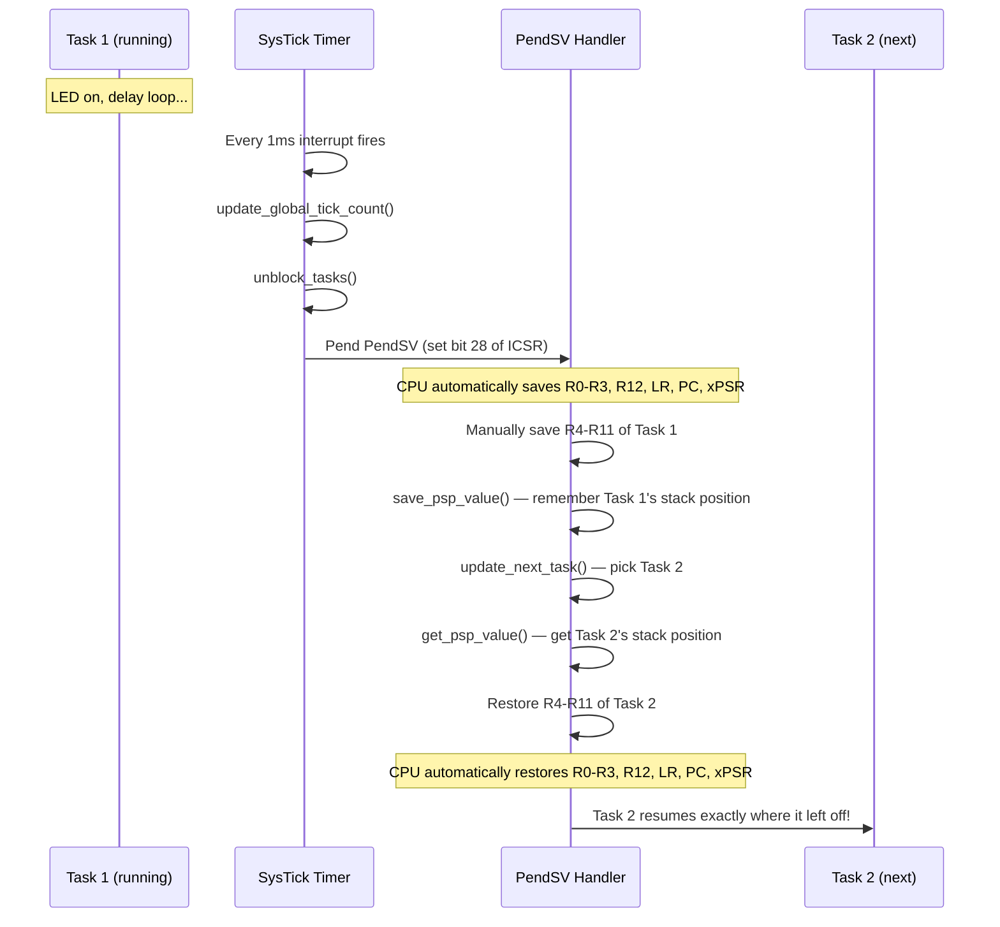

# STM32F407 Round-Robin Task Scheduler - Explained

## What Does This Program Do?

This program runs on an **STM32F407** microcontroller (a tiny computer on a chip). It makes **4 LEDs blink at different speeds** — all at the same time! But the processor can only do one thing at a time, so we use a **task scheduler** to rapidly switch between 4 tasks, giving the *illusion* that everything runs simultaneously. This is the same idea behind how your computer runs multiple apps at once.


---

## The Big Picture: Program Flow



---

## Memory Layout: How the Stacks Are Organized

Think of RAM as a tall building. Each task gets its own "floor" (1024 bytes) to store its private data:

```
    Address                   What Lives Here
    ─────────────────────────────────────────────
    0x20020000 (SRAM_END)  ── Top of Task 1 Stack
                           │  Task 1 (1024 bytes)
    0x2001FC00             ── Top of Task 2 Stack
                           │  Task 2 (1024 bytes)
    0x2001F800             ── Top of Task 3 Stack
                           │  Task 3 (1024 bytes)
    0x2001F400             ── Top of Task 4 Stack
                           │  Task 4 (1024 bytes)
    0x2001F000             ── Top of Idle Task Stack
                           │  Idle Task (1024 bytes)
    0x2001EC00             ── Top of Scheduler Stack
                           │  Scheduler (1024 bytes)
    0x2001E800             ── Bottom of Scheduler Stack
                           │
    0x20000000 (SRAM_START)── Start of RAM
```

---

## Task Scheduling: The Round-Robin Cycle



Every 1 millisecond, the SysTick timer fires an interrupt and the scheduler switches to the next task. The tasks go in order: 1 → 2 → 3 → 4 → 1 → 2 → ... If a task is blocked (sleeping), it gets skipped. If ALL tasks are blocked, the idle task runs.

---

## Context Switching: What Happens During a Task Switch



---

## Detailed Function Explanations

### 1. `main()` — The Starting Point

```c
int main(void)
{
    enable_processor_faults();
    init_scheduler_stack(SCHED_STACK_START);
    init_tasks_stack();
    led_init_all();
    init_systick_timer(TICK_HZ);
    switch_sp_to_psp();
    task1_handler();
    for(;;);
}
```

This is where the program begins after the chip powers on. It calls a series of setup functions in a specific order — like a checklist before the scheduler can start:

1. **Enable fault handlers** so we get helpful error messages if something goes wrong.
2. **Set up the scheduler's own stack** — the scheduler needs its own private memory area to work from.
3. **Prepare each task's stack** with fake "starting data" so when the scheduler first switches to a task, it looks like the task was already running.
4. **Initialize the 4 LEDs** on the board (configure the GPIO pins).
5. **Start the SysTick timer** ticking at 1000 Hz (once every 1 millisecond).
6. **Switch the processor to use PSP** (Process Stack Pointer) instead of MSP (Main Stack Pointer), so tasks use their own private stacks.
7. **Jump into Task 1** to start execution. From here on, the SysTick interrupt will take over and start switching between tasks.

The `for(;;)` at the end is a safety net — the code should never reach it.

---

### 2. `enable_processor_faults()` — Turning On Safety Nets

```c
void enable_processor_faults(void)
{
    uint32_t *pSHCSR = (uint32_t*)0xE000ED24;
    *pSHCSR |= ( 1 << 16); // MemManage fault
    *pSHCSR |= ( 1 << 17); // Bus fault
    *pSHCSR |= ( 1 << 18); // Usage fault
}
```

By default, if the processor does something wrong (like accessing invalid memory), it just triggers a generic "HardFault" which is hard to debug. This function enables **three specific fault handlers**:

- **MemManage Fault** (bit 16): Triggers when you access memory you shouldn't (like trying to write to read-only flash).
- **Bus Fault** (bit 17): Triggers when there's an error on the memory bus (like accessing an address that doesn't exist).
- **Usage Fault** (bit 18): Triggers when the processor encounters an invalid instruction or does something illegal (like dividing by zero).

The address `0xE000ED24` is the **System Handler Control and State Register (SHCSR)** — a special register built into every ARM Cortex-M4 processor.

---

### 3. `init_scheduler_stack()` — Giving the Scheduler Its Own Stack

```c
__attribute__((naked)) void init_scheduler_stack(uint32_t sched_top_of_stack)
{
    __asm volatile("MSR MSP,%0": : "r" (sched_top_of_stack) : );
    __asm volatile("BX LR");
}
```

The ARM Cortex-M4 has **two stack pointers**:
- **MSP (Main Stack Pointer)**: Used by the OS/scheduler and interrupt handlers.
- **PSP (Process Stack Pointer)**: Used by application tasks.

This function sets MSP to point to the scheduler's stack area (address `0x2001EC00`). The `__attribute__((naked))` tells the compiler "don't add any extra code to this function" — we're writing pure assembly and managing everything ourselves.

- `MSR MSP,%0` — Write the value of `sched_top_of_stack` into the MSP register.
- `BX LR` — Return to the caller (Branch eXchange to Link Register).

---

### 4. `init_tasks_stack()` — Preparing Fake Stack Frames for Each Task

```c
void init_tasks_stack(void) { /* ... */ }
```

This is one of the most important and clever functions. Before the scheduler can switch to a task, the task's stack must look **exactly like** the processor just interrupted it and saved its state. So we *fake* a stack frame.

For each of the 5 tasks (idle + 4 user tasks), it:

1. **Sets the initial state** to `TASK_READY_STATE` (ready to run).
2. **Assigns a stack area** — each task gets its own 1024-byte chunk of RAM.
3. **Assigns a handler function** — the actual code each task will run.
4. **Fills in a dummy stack frame** that mimics what the hardware would save during an interrupt:

```
    Stack (growing downward):
    ┌──────────────┐  ← Original top of stack
    │    xPSR      │  = 0x01000000 (Thumb bit set — required!)
    │    PC        │  = address of task_handler function
    │    LR        │  = 0xFFFFFFFD (special EXC_RETURN value)
    │    R12       │  = 0
    │    R3        │  = 0
    │    R2        │  = 0
    │    R1        │  = 0
    │    R0        │  = 0  ← Hardware saves these automatically
    │──────────────│
    │    R11       │  = 0
    │    R10       │  = 0
    │    R9        │  = 0
    │    R8        │  = 0
    │    R7        │  = 0
    │    R6        │  = 0
    │    R5        │  = 0
    │    R4        │  = 0  ← Software saves these manually
    └──────────────┘  ← New PSP value saved in TCB
```

**Why `0xFFFFFFFD` for LR?** This is a special ARM value called **EXC_RETURN**. It tells the processor: "when you return from this exception, go back to Thread mode using PSP." This is critical for the context switch to work correctly.

**Why `0x01000000` for xPSR?** Bit 24 is the **Thumb bit**. The Cortex-M4 *only* runs Thumb instructions, so this bit must always be set, or the processor will fault.

---

### 5. `led_init_all()` — Setting Up the Hardware LEDs

```c
void led_init_all(void)
{
    uint32_t *pRccAhb1enr = (uint32_t*)0x40023830;
    uint32_t *pGpiodModeReg = (uint32_t*)0x40020C00;
    *pRccAhb1enr |= ( 1 << 3);           // Enable GPIOD clock
    *pGpiodModeReg |= ( 1 << (2 * 12));  // Pin 12 = output (Green)
    *pGpiodModeReg |= ( 1 << (2 * 13));  // Pin 13 = output (Orange)
    *pGpiodModeReg |= ( 1 << (2 * 14));  // Pin 14 = output (Red)
    *pGpiodModeReg |= ( 1 << (2 * 15));  // Pin 15 = output (Blue)
}
```

On the STM32F407 Discovery board, there are 4 LEDs connected to **GPIO Port D**, pins 12–15. Before we can use them, we need to:

1. **Turn on the clock** to GPIO Port D by setting bit 3 in the RCC AHB1 Enable Register (`0x40023830`). On STM32, peripherals are turned off by default to save power.
2. **Configure each pin as an output** by writing to the GPIO Mode Register (`0x40020C00`). Each pin has 2 bits in this register — setting them to `01` means "general purpose output."

After configuration, all LEDs are turned off to start clean.

---

### 6. `led_on()` and `led_off()` — Controlling Individual LEDs

```c
void led_on(uint8_t led_no)  { *((uint32_t*)0x40020C14) |=  (1 << led_no); }
void led_off(uint8_t led_no) { *((uint32_t*)0x40020C14) &= ~(1 << led_no); }
```

These write directly to the **GPIO Output Data Register** (`0x40020C14`):
- `led_on` **sets** the bit for that pin → voltage goes HIGH → LED lights up.
- `led_off` **clears** the bit for that pin → voltage goes LOW → LED turns off.

---

### 7. `init_systick_timer()` — The Heartbeat of the Scheduler

```c
void init_systick_timer(uint32_t tick_hz)
{
    uint32_t *pSRVR = (uint32_t*)0xE000E014;  // Reload Value Register
    uint32_t *pSCSR = (uint32_t*)0xE000E010;  // Control/Status Register

    uint32_t count_value = (SYSTICK_TIM_CLK / tick_hz) - 1;  // = 15999
    *pSRVR &= ~(0x00FFFFFFFF);  // Clear old value
    *pSRVR |= count_value;       // Set new reload value
    *pSCSR |= (1 << 1);          // Enable SysTick interrupt
    *pSCSR |= (1 << 2);          // Use processor clock (16 MHz)
    *pSCSR |= (1 << 0);          // Enable the counter
}
```

The **SysTick timer** is a simple countdown timer built into every ARM Cortex-M processor. It's the "heartbeat" that drives our scheduler.

**How it works:**
- The processor clock runs at **16 MHz** (16,000,000 ticks per second).
- We want an interrupt every **1 millisecond** (1000 Hz).
- So we need to count: 16,000,000 ÷ 1,000 = **16,000 clock cycles** per interrupt.
- We load 15,999 (minus 1 because counting starts from 0).
- Every time the counter reaches 0, it fires an interrupt and reloads automatically.

This means the `SysTick_Handler()` function gets called **1,000 times per second**, giving each task a 1ms time slice.

---

### 8. `switch_sp_to_psp()` — Switching from OS Mode to Task Mode

```c
__attribute__((naked)) void switch_sp_to_psp(void)
{
    __asm volatile ("PUSH {LR}");
    __asm volatile ("BL get_psp_value");    // R0 = Task 1's PSP value
    __asm volatile ("MSR PSP,R0");          // Set PSP register
    __asm volatile ("POP {LR}");
    __asm volatile ("MOV R0,#0X02");
    __asm volatile ("MSR CONTROL,R0");      // Switch to PSP
    __asm volatile ("BX LR");
}
```

Up until this point, everything has been running using MSP (the "main" stack, used by the OS). Now we need to switch to PSP (the "process" stack) so that Task 1 can use its own private stack.

**Step by step:**
1. Save LR (return address) because we're about to call another function.
2. Call `get_psp_value()` — this returns the PSP value for the current task (Task 1) in register R0.
3. Load that value into the PSP register.
4. Restore LR.
5. Write `0x02` to the **CONTROL register**. Bit 1 = 1 means "use PSP for stack operations in Thread mode."
6. Return. From now on, all task code uses PSP!

---

### 9. `task1_handler()` through `task4_handler()` — The Actual Tasks

```c
void task1_handler(void) {
    while(1) {
        led_on(LED_GREEN);
        delay(DELAY_COUNT_1S);
        led_off(LED_GREEN);
        delay(DELAY_COUNT_1S);
    }
}
```

Each task is a simple infinite loop that:
1. Turns on its LED.
2. Waits for a certain amount of time.
3. Turns off its LED.
4. Waits again.
5. Repeats forever.

| Task | LED Color | Blink Period |
|------|-----------|-------------|
| Task 1 | 🟢 Green | 1 second |
| Task 2 | 🟠 Orange | 500 ms |
| Task 3 | 🔵 Blue | 250 ms |
| Task 4 | 🔴 Red | 125 ms |

Even though each task has `while(1)` (an infinite loop), the scheduler interrupts them every 1ms to give other tasks a turn. The task doesn't even know it was interrupted!

---

### 10. `idle_task()` — The Do-Nothing Task

```c
void idle_task(void) {
    while(1);
}
```

This is the simplest possible task — it just spins in an empty loop forever. It exists as a **safety net**: if all 4 real tasks are blocked (sleeping), the processor needs *something* to run. The idle task keeps the processor busy doing nothing until a real task wakes up.

---

### 11. `SysTick_Handler()` — The Scheduler's Alarm Clock

```c
void SysTick_Handler(void)
{
    uint32_t *pICSR = (uint32_t*)0xE000ED04;
    update_global_tick_count();
    unblock_tasks();
    *pICSR |= (1 << 28);  // Pend PendSV
}
```

This function is called **automatically by the hardware** every 1 millisecond. It does three things:

1. **`update_global_tick_count()`** — Increments the global counter (`g_tick_count++`). This is like a clock that counts milliseconds since boot.
2. **`unblock_tasks()`** — Checks each task: "Has your sleep timer expired?" If yes, marks it as READY so the scheduler will run it again.
3. **Pend PendSV** — Sets bit 28 of the **Interrupt Control and State Register (ICSR)** at `0xE000ED04`. This doesn't immediately switch tasks — it *requests* a PendSV exception, which will fire at the lowest priority after SysTick finishes.

**Why use PendSV instead of switching directly in SysTick?** Because SysTick runs at a high priority. If we did the context switch here, we might delay other important interrupts. PendSV runs at the **lowest priority**, so the context switch happens only when nothing more urgent is pending. This is a standard pattern in real-time OS design.

---

### 12. `PendSV_Handler()` — The Actual Context Switcher

```c
__attribute__((naked)) void PendSV_Handler(void)
{
    // SAVE current task
    __asm volatile("MRS R0,PSP");              // Get current PSP
    __asm volatile("STMDB R0!,{R4-R11}");      // Push R4-R11 onto task's stack
    __asm volatile("PUSH {LR}");
    __asm volatile("BL save_psp_value");        // Save updated PSP in TCB

    // LOAD next task
    __asm volatile("BL update_next_task");      // Pick next task
    __asm volatile("BL get_psp_value");         // Get next task's PSP
    __asm volatile("LDMIA R0!,{R4-R11}");       // Pop R4-R11 from next task's stack
    __asm volatile("MSR PSP,R0");               // Set PSP to next task's stack
    __asm volatile("POP {LR}");
    __asm volatile("BX LR");                    // Return → CPU restores R0-R3, PC, etc.
}
```

This is the **heart of the scheduler** — the code that actually switches from one task to another. It's written in assembly because it directly manipulates CPU registers.

**Saving the current task (first half):**
1. Read the current PSP (Process Stack Pointer) — this tells us where the current task's stack is.
2. `STMDB R0!,{R4-R11}` — **Store Multiple, Decrement Before** — pushes registers R4 through R11 onto the task's stack. (The hardware already saved R0-R3, R12, LR, PC, and xPSR automatically when the exception occurred.)
3. Save this updated PSP value into the task's TCB (Task Control Block) so we can find it again later.

**Loading the next task (second half):**
1. `update_next_task()` — Decides which task to run next (round-robin, skip blocked tasks).
2. `get_psp_value()` — Gets the saved PSP for that next task.
3. `LDMIA R0!,{R4-R11}` — **Load Multiple, Increment After** — pops R4 through R11 from the next task's stack.
4. Set PSP to the next task's stack pointer.
5. Return — the hardware automatically restores R0-R3, R12, LR, PC, and xPSR, and execution resumes in the next task exactly where it left off!

---

### 13. `update_next_task()` — Choosing Who Runs Next

```c
void update_next_task(void)
{
    int state = TASK_BLOCKED_STATE;
    for(int i = 0; i < MAX_TASKS; i++)
    {
        current_task++;
        current_task %= MAX_TASKS;        // Wrap around: 0→1→2→3→4→0→1→...
        state = user_tasks[current_task].current_state;
        if((state == TASK_READY_STATE) && (current_task != 0))
            break;
    }
    if(state != TASK_READY_STATE)
        current_task = 0;                 // Fall back to idle task
}
```

This implements **round-robin scheduling**:

1. Start from the task *after* the current one.
2. Check each task in order: "Are you READY to run?"
3. Skip task 0 (the idle task) — we only want idle as a last resort.
4. If a READY task is found, select it and stop looking.
5. If we checked all tasks and none are ready, fall back to the **idle task** (task 0).

---

### 14. `task_delay()` — Putting a Task to Sleep

```c
void task_delay(uint32_t tick_count)
{
    INTERRUPT_DISABLE();
    if(current_task)
    {
        user_tasks[current_task].block_count = g_tick_count + tick_count;
        user_tasks[current_task].current_state = TASK_BLOCKED_STATE;
        schedule();
    }
    INTERRUPT_ENABLE();
}
```

> **Note:** This function is declared but the tasks in this code use `delay()` (a busy-wait loop) instead. `task_delay()` is the *smarter* version that would allow other tasks to run during the wait.

When a task calls `task_delay(500)`, it:
1. **Disables interrupts** — we're modifying shared data, so we don't want the scheduler interfering mid-update.
2. Sets `block_count` to the future tick when this task should wake up (current time + delay).
3. Marks the task as **BLOCKED** — the scheduler will skip it.
4. Calls `schedule()` which triggers a PendSV to immediately switch to another task.
5. **Re-enables interrupts** — but this line actually runs *after* the task wakes up and gets scheduled back!

The idle task (task 0) is never allowed to block itself (`if(current_task)` checks for this).

---

### 15. `unblock_tasks()` — Waking Up Sleeping Tasks

```c
void unblock_tasks(void)
{
    for(int i = 1; i < MAX_TASKS; i++)
    {
        if(user_tasks[i].current_state != TASK_READY_STATE)
        {
            if(user_tasks[i].block_count == g_tick_count)
            {
                user_tasks[i].current_state = TASK_READY_STATE;
            }
        }
    }
}
```

Called every millisecond by `SysTick_Handler()`. It checks each task (skipping idle): "Are you BLOCKED and is your wake-up time now?" If yes, it changes the task's state back to **READY** so the scheduler will include it in the round-robin again.

---

### 16. `schedule()` — Requesting a Task Switch

```c
void schedule(void)
{
    uint32_t *pICSR = (uint32_t*)0xE000ED04;
    *pICSR |= (1 << 28);  // Set PendSV pending bit
}
```

This doesn't switch tasks directly. It sets the **PendSV pending bit** in the ICSR register, which tells the processor: "Please run the PendSV handler when you get a chance." The actual switch happens in `PendSV_Handler()`.

---

### 17. The Task Control Block (TCB) — Each Task's ID Card

```c
typedef struct {
    uint32_t psp_value;       // Where this task's stack pointer is
    uint32_t block_count;     // When to wake up (if blocked)
    uint8_t  current_state;   // READY (0x00) or BLOCKED (0xFF)
    void (*task_handler)(void); // Pointer to the task's function
} TCB_t;

TCB_t user_tasks[MAX_TASKS]; // Array of 5 TCBs
```

Each task has a **TCB** — a small structure that the scheduler uses to keep track of it:
- **`psp_value`**: The saved stack pointer. When we switch away from a task, we save where its stack was so we can resume later.
- **`block_count`**: If the task is sleeping, this is the tick count when it should wake up.
- **`current_state`**: Either READY (can be scheduled) or BLOCKED (sleeping, skip me).
- **`task_handler`**: A pointer to the function that *is* the task.

---

## Summary: How It All Fits Together

1. **Boot up**: `main()` initializes everything — faults, stacks, LEDs, timer, then starts Task 1.
2. **Every 1ms**: The SysTick timer fires, incrementing the tick counter, waking up any tasks whose sleep timers expired, and requesting a context switch via PendSV.
3. **Context switch**: PendSV saves the current task's CPU registers onto its private stack, picks the next ready task, loads that task's registers from its stack, and resumes it.
4. **Round-robin**: Tasks run in order 1→2→3→4→1→... Blocked tasks are skipped. If all are blocked, the idle task runs.
5. **Result**: All 4 LEDs appear to blink simultaneously at different rates, even though only one task runs at any given instant!

---

## Glossary for Beginners

| Term | Meaning |
|------|---------|
| **Task** | A function that runs as an independent "mini-program" |
| **Scheduler** | The code that decides which task runs next |
| **Context Switch** | Saving one task's state and loading another's |
| **Stack** | A chunk of memory where a task stores its local variables and saved registers |
| **PSP** | Process Stack Pointer — points to the current task's stack |
| **MSP** | Main Stack Pointer — used by the OS and interrupt handlers |
| **SysTick** | A hardware timer that fires an interrupt at a fixed rate |
| **PendSV** | A special low-priority exception used for context switching |
| **TCB** | Task Control Block — a struct holding a task's private info |
| **Round-Robin** | A scheduling method where each task gets an equal turn |
| **Blocked** | A task state meaning "I'm sleeping, don't run me yet" |
| **GPIO** | General Purpose Input/Output — the pins that connect to LEDs |
